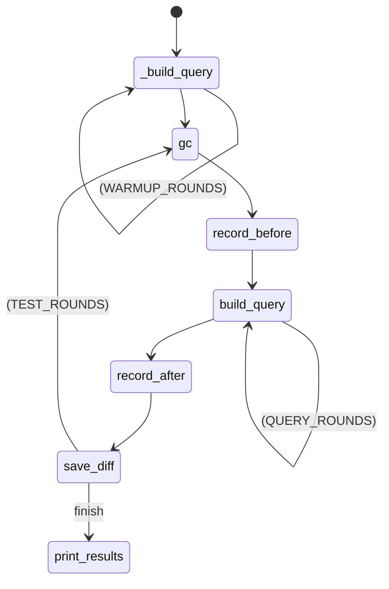

# kysely-params-benchmarks

Memory usage and duration for sql generation: [kysely](https://github.com/kysely-org/kysely) vs [kysely + kysely-params](https://github.com/jtlapp/kysely-params)

Results may vary depending on environment, so please share yours, and I'll update readme.

As you know, v8 engine has garbage collector, so it's hard to measure memory usage accurately.  
So I set default ROUNDS to high value, and it takes 45 minutes in my environment.  
If you want to see result quickly, adjust the ROUNDS.

See [Diagram](#diagram) to know how it works.

## Results


```
os              linux Ubuntu 22.04.2 LTS x64
cpu             Intel Gen Intel® Core™ i7-12700K
memory          46.85GB

WARMUP_ROUNDS   4000
QUERY_ROUND     1000
TEST_ROUNDS     10000


no-op
-----------------------------------------------
min             0.00kb
max             0.22kb
avg             0.00kb

min             0.000ms
max             0.000ms
avg             0.000ms


kysely-0
-----------------------------------------------
min             0.92kb
max             1.39kb
avg             0.99kb

min             0.001ms
max             0.002ms
avg             0.001ms


kysely-params-0
-----------------------------------------------
min             0.23kb
max             0.49kb
avg             0.23kb

min             0.000ms
max             0.000ms
avg             0.000ms


kysely-1
-----------------------------------------------
min             1.87kb
max             2.36kb
avg             2.05kb

min             0.002ms
max             0.005ms
avg             0.002ms


kysely-params-1
-----------------------------------------------
min             0.25kb
max             0.75kb
avg             0.48kb

min             0.000ms
max             0.000ms
avg             0.000ms


kysely-2
-----------------------------------------------
min             14.40kb
max             14.93kb
avg             14.64kb

min             0.012ms
max             0.018ms
avg             0.013ms


kysely-params-2
-----------------------------------------------
min             0.27kb
max             0.52kb
avg             0.38kb

min             0.000ms
max             0.000ms
avg             0.000ms


kysely-3
-----------------------------------------------
min             11.89kb
max             12.52kb
avg             12.25kb

min             0.024ms
max             0.043ms
avg             0.026ms


kysely-params-3
-----------------------------------------------
min             0.28kb
max             0.53kb
avg             0.39kb

min             0.000ms
max             0.000ms
avg             0.000ms


kysely-4
-----------------------------------------------
min             10.42kb
max             11.13kb
avg             10.92kb

min             0.036ms
max             0.063ms
avg             0.038ms


kysely-params-4
-----------------------------------------------
min             0.41kb
max             0.66kb
avg             0.56kb

min             0.000ms
max             0.001ms
avg             0.000ms

Done in 2739.24s.

```


## Usage

1. setup node_modules  
`yarn install` or `npm install`

2. start  
`yarn start` or `npm start`


* To see which query is used, pass `-q`:  
  `yarn start -q` or `npm start -q`

## Diagram


